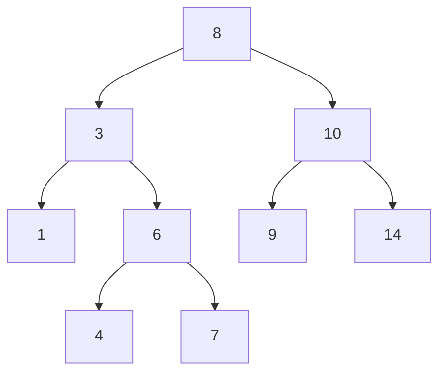

A **Binary Search Tree (BST)** is a specific type of Tree data structure where each node has at most two children, referred to as the *left child* and the *right child*. It maintains strict rules with the goal of making searching, insertion, and deletion efficient.
#### Properties
1.  The value of the **Left Child** is *less than* the value of the **Parent Node**.
2.  The value of the **Right Child** is *greater than* (or equal to, depending on implementation) the value of the **Parent Node**.
3.  Both the left and right sub-trees must also be Binary Search Trees.

In this example:
- **8** is the Root.
- Everything to the left of 8 (3, 1, 6, 4, 7) is smaller than 8.
- Everything to the right of 8 (10, 9, 14) is larger than 8.
---
#### Traversal
Traversing a BST in specific orders yields different results:
- **In-Order Traversal:** *Left, Root, Right* **|** Visits nodes in **sorted** (ascending) order.
- **Pre-Order Traversal:** *Root, Left, Right* **|** Useful for copying the tree.
- **Post-Order Traversal:** *Left, Right, Root* **|** Useful for deleting the tree.

---
#### Time Complexity
BSTs are designed to optimize search operations. By comparing the target value to the current node, you can eliminate half the remaining tree at each step (in a balanced tree), similar to Binary Search.

| Operation  | Balanced Case | Unbalanced Case |
| :--------- | :------------ | :-------------- |
| **Search** | $O(log(n))$   | $O(n)$          |
| **Insert** | $O(log(n))$   | $O(n)$          |
| **Delete** | $O(log(n))$   | $O(n)$          |

*See Time Complexity for more details on Big-O notation.*

> [!WARNING] O(n)?
> If a BST becomes "unbalanced" (i.e., inserting numbers 1, 2, 3, 4, 5 in order), it essentially becomes a Linked List. 
> To prevent this, we use **Self-Balancing Trees**:
> - AVL Trees
> - Red/Black Trees
---
#### Operations
**Insertion**

**Deletion**

**Search**

**Free (Post-Order Traverse)**

---