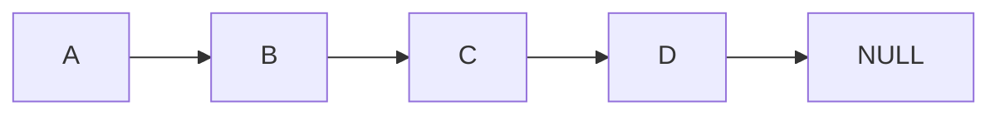
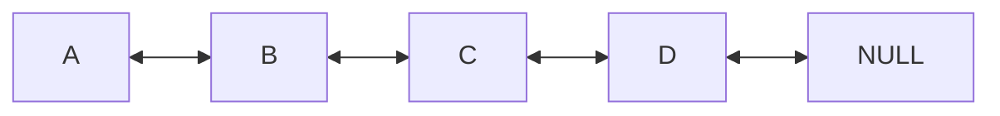
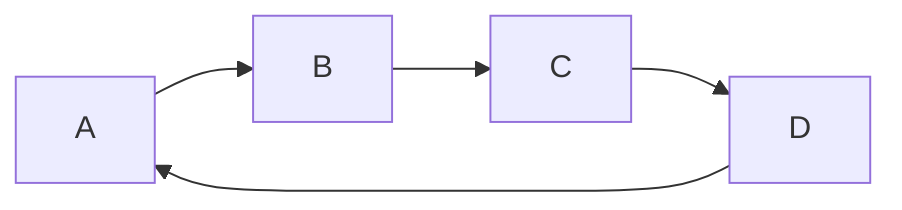

A Linked List is a very core linear data structure. Many other data structures can be thought of as an extension of the Linked List. A Linked List is simply a list of elements that are _not_ saved sequentially in memory (unlike Basic Array(s)). Instead, elements are saved dynamically (randomly) on the _Heap(s)_ using **Pointers**.

---

#### Types of Linked Lists

**Singly Linked List**

**Doubly Linked List**

**Circular List**
A Circular Linked-List simply means instead of the last node pointing to NULL, it points back to the first element. Circular Linked Lists can be singly or doubly linked.

---

#### Pros & Cons (Time & Space Complexity)

**Pros:**
Linked Lists are _dynamically allocated to the heap_ (as opposed to Basic Array(s)). This avoids the main issue with Arrays, their fixed size. Linked Lists can be also very efficient for insertion or deletion making them well suited for basing other Data Structures from (i.e. Stack(s) , Queue(s)). Time Complexity for Inserting/deleting to head/tail is independent from the size of the list, or $θ(1)$.

**Cons:**
Linked Lists struggle when it comes to **Random Access** (unlike Basic Array(s)) and **Cache Locality** (due to non-sequential memory).

---

