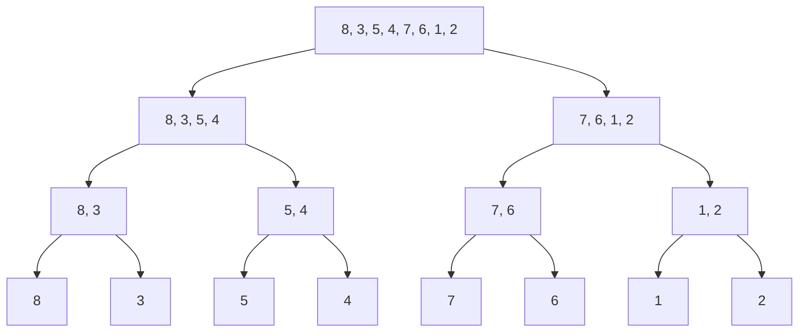
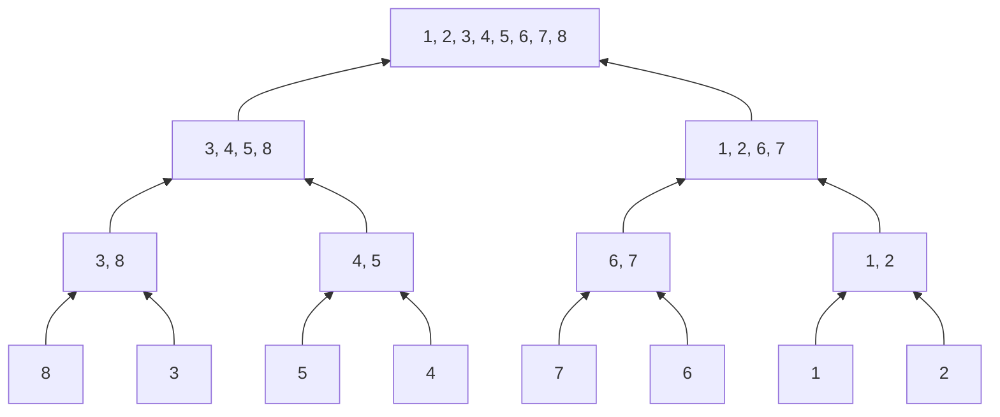

**Merge Sort** is a robust, efficient, and **stable** sorting algorithm that follows the Divide-&-Conquer paradigm. Unlike Quick Sort, it guarantees $O(n \log n)$ performance in the worst case.

---

#### The Algorithm

1.  **Divide:** Recursively split the array into two halves until each sub-array contains a single element (base case).
    _We don't actually create new arrays here (in an optimized C implementation); we just calculate indices._

2.  **Conquer:** Repeatedly merge the sub-arrays to produce new sorted sub-arrays until only one remains.

---

#### Complexity Analysis

| Metric           | Rating        | Reason                                                                               |
| :--------------- | :------------ | :----------------------------------------------------------------------------------- |
| **Time (Worst)** | $O(n \log n)$ | The tree height is $\log n$, and merging takes $O(n)$ work per level.                |
| **Time (Best)**  | $O(n \log n)$ | Always splits and merges fully (unlike Bubble/Insertion sort).                       |
| **Space**        | $O(n)$        | **Critical Disadvantage.** Requires auxiliary memory for the temporary merge arrays. |
| **Stability**    | **Yes**       | Preserves the relative order of equal elements (crucial for multi-key sorting).      |

---

##### C Implementation

NOTE: `malloc` overhead is expensive. A production-grade Merge Sort often allocates the temporary buffer _once_ at the start, rather than inside every recursive call.

---

#### Linked Lists (The Use Case)

Merge Sort is the **preferred** algorithm for sorting Linked Lists.

- **Why?:** Random access (needed for Quick Sort) is slow in lists. Merge Sort accesses data sequentially, which fits the Linked List structure perfectly.
- **Space Benefit:** For Linked Lists, Merge Sort can be implemented with **$O(1)$ auxiliary space** (just pointer manipulation), negating its main disadvantage.

---

